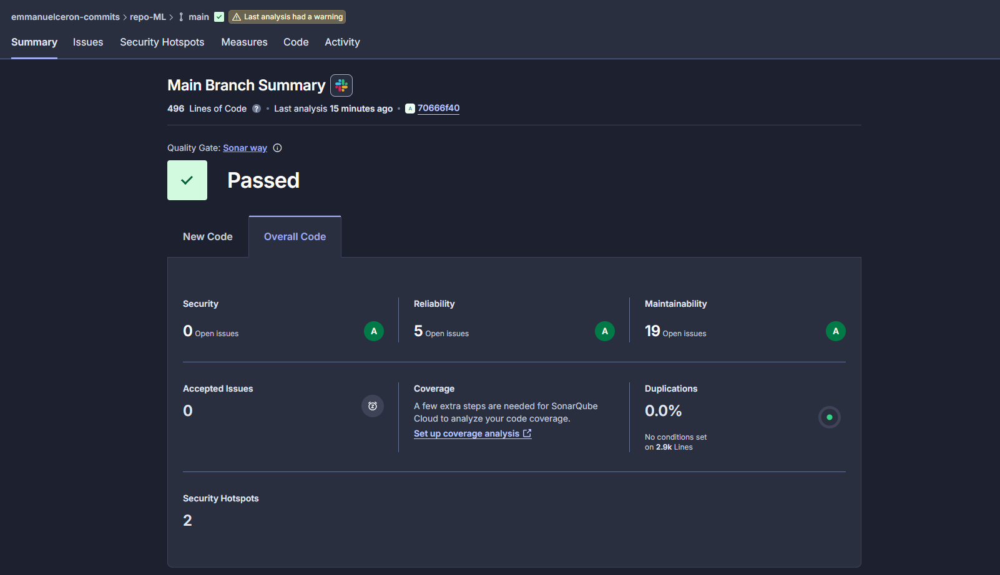
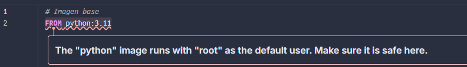
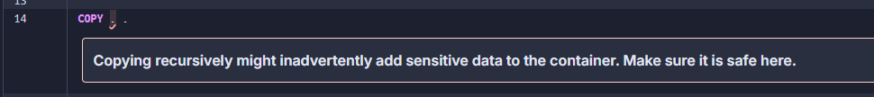

# 💻 Proyecto de Machine Learning

## 🐶🐱🐾 Clasificación de adoptadibilidad de mascotas 🐰🐹🎲

Este es un **proyecto para el curso de Machine Learning**, en el que se principalmente se busca realizar el **desarrollo y despliegue de un modelo supervisado predictivo** bajo una comprensión del negocio al que se brinda el proyecto como una solución. 

En este caso, la idea es desarrollar un modelo capaz predecir la **probabilidad de adopción de mascotas**, lo cual podría ayudar a entidades como los refugios de mascotas a plantear nuevas estrategias para priorizar y optimizar las adopciones.

Todo esto se puede lograr con la ayuda de una **base de datos de mascotas** (en este caso, un dataset de Kaggle) acompañada con una **variable objetivo** (como lo es AdoptionLikelihood en nuestro dataset), que permita diferenciar a mascotas más fáciles de adoptar todo esto **dentro del esquema de MLops**.

[Link del dataset original en Kaggle](https://www.kaggle.com/datasets/rabieelkharoua/predict-pet-adoption-status-dataset/data)

---

## 🕵️ Algunos hallazgos del dataset durante la exploración del dataset (comprension_eda.ipynb)

### ℹ️ Descripción general de los datos

Este dataset de Kaggle contiene 2007 datos de mascotas en adopción, el cuál es sintético y fue recolectado en un periodo específico de tiempo con propósitos educacionales. 

>[!note]
> Si bien esto **no lo hace ideal para generalizar el comportamiento de las adopciones**, termina siendo ideal para proyectos de Machine Learning o Data Science con interés de aprender, predecir y entender tendencias de adopciones. 

Estos datos se pueden usar para:

- Modelamiento predictivo para determinar la adoptabilidad de una mascota

- Análisis de impacto de varios factores en las tasas de adopción

- Desarrollo de estrategias para incrementar las adopciones.

⛔ No hay nulos en el dataset

### 🔎📑📊 Hallazgos relevantes en la exploración de datos (EDA)

- Las mascotas con menos de 50 meses tienden a ser más adoptadas
- Las mascotas con más de 100 meses tienden a ser menos adoptadas

- La diferencia entre mascotas adoptadas y sin adoptar en el dataset es de 1 a 3 (un 33% aprox son adoptadas, un 66% están sin adoptar), lo cual puede ser un desbalanceo que deba considerarse en el modelamiento

Luego de revisar la relación entre variables categóricas y la variable objetivo:

- Si p ≈ 0 y Cramer's V > 0.3, hay relación real y relevante. Las variables Size y Vaccinated entran en esta categoría

- Si p ≈ 0 pero Cramer's V < 0.2 → relación estadísticamente detectable pero débil (Breed, PetType, HealthCondition).

- Si p es grande (ej. 0.37 en Color) → no hay casi evidencia de relación, y además V confirma que es irrelevante. Por lo que PreviousOwner y Color pueden no influir mucho en la adoptabilidad.

Posibles reglas de validación de datos:

- AgeMonths debe ser >= 0 y < 240.

- WeightKg > 0 y < 100.

- Categorías con muy pocos registros agrupar en 'Other' (ej. razas raras).

- Especie que coincida con raza

**[Abrir notebook de comprensión_eda.ipynb para ver más detalles](./MLops_pipeline/src/comprension_eda.ipynb)**

---

## 🛠️👷 Decisiones relevantes en la ingeniería de características (ft_engineering.py)

- **Imputación de valores faltantes:**  
  Se utilizó la mediana para variables numéricas y la moda para variables categóricas, con el fin de conservar la distribución original sin afectar la varianza de los datos.

- **Codificación de variables categóricas:**  
  Se aplicó `OneHotEncoder` para representar las variables `PetType` y `Breed`, evitando sesgos ordinales artificiales.

- **Estandarización / Escalado:**  
  Se aplicó `MinMaxScaler` para variables numéricas (como edad o peso), permitiendo que todos los atributos estén en la misma escala y mejorando la estabilidad de los modelos.

- **Conversión de variables ordinales:**  
  Las variables `Size` y `Color` se mapearon manualmente a valores numéricos de acuerdo con su orden lógico.

- **Separación de conjuntos:**  
  Los datos se dividieron en entrenamiento (80%) y prueba (20%) para garantizar una evaluación imparcial del modelo.

- **Selección de atributos:**  
  Se eliminaron variables redundantes o irrelevantes (por ejemplo, identificadores únicos o campos descriptivos de texto no estandarizados).

**[Puedes abrir ft_engineering.py para ver más detalles](./MLops_pipeline/src/ft_engineering.py)**

---
## 📁 Estructura del repositorio

<details><summary>(Desplegar para ver la estructura recomendada y planteada en clase)</summary>


```
repo-ML/
└── MLops_pipeline/
│   └── src/
│        ├── Cargar_datos.ipynb       # Carga de dataset
│        ├── comprension_eda.ipynb    # Análisis exploratorio
│        ├── ft_engineering.py        # Generación de features y creación de datasets
│        ├── heuristic_model.py       # Modelo base
│        ├── model_training.ipynb     # Entrenamiento y comparación de modelos
│        ├── model_deploy.ipynb       # Despliegue
│        ├── model_evaluation.ipynb   # Evaluación
│        └── model_monitoring.ipynb   # Monitoreo
│
├── config.json                       # Archivo de configuración de pipeline
├── Base_de_datos.csv                 # Dataset de ejm
├── requirements.txt                  # Librerías y dependencias
├── .gitignore                        # Exclusiones de git
├── readme.md                         # Documentación del proyecto
└── set_up.bat                        # Script para preparar el entorno
```
</details>

---


Estructura de archivos usados en el proyecto:
```
repo-ML/
└── MLops_pipeline/
│   └── src/                        
│        ├── config.json                    # Archivo de configuración para setup
│        ├── Cargar_datos.ipynb             # Carga de dataset
│        ├── comprension_eda.ipynb          # Análisis exploratorio
│        ├── ft_engineering.py              # Generación de features
│        ├── model_training_evualation.py   # Entrenamiento y comparación de modelos
│        ├── model_monitoring.py            # Monitoreo
│        ├── model_deploy.py                # Despliegue (API)
│        └── app_streamlit.py               # Interfaz visual de streamlit
│
├── Base_de_datos.csv                       # Ubicación del dataset
├── requirements.txt                        # Librerías y dependencias
├── requirements_docker.txt                 # Dependencias imagen Docker
├── Dockerfile                              # Configuración docker
├── .dockerignore                           # Exclusiones de docker
├── .gitignore                              # Exclusiones de git
├── README.md                               # Documentación del proyecto
└── set_up.bat                              # Script para preparar el entorno
```
---
## 🛤️ Flujos de ejecución del repositorio

Teniendo instalado Python, luego de descargar el repositorio y posicionarse en la carpeta raíz:

1. Ejecutar set_up.bat, creará el entorno e instalará las librerías necesarias para la ejecución

2. Inicializar el entorno (lo hace set_up.bat)

> Si el entorno no se inició con set_up.bat, abrir la terminal de comandos ubicandose en la carpeta raíz y ejecutar el siguiente comando:

```
pet_adoption_ml-venv\Scripts\activate
```
3. Ubicarse en la carpeta src para los demás pasos

```
cd .\MLops_pipeline\src\
```

### ⚙️🧑‍💻📊 Transformaciones, modelamiento y generación de métricas

- Generación de features:
```
python ft_engineering.py
```
- Entrenamiento y evaluamiento de modelos 
```
python model_training_evaluation.py
```
- Monitoreo
```
python model_monitoring.py
```

> Luego de ejecutar estos pasos, se habrán generado archivos de modelos `.pkl` y algunas métricas en `.csv` que se usarán más adelante.

---

### 🦄 Despliegue de API con uvicorn
Esta API usa el modelo que mejor se desempeñó (en nuestro caso, Random Forest) para generar las probabilidad de adopción de las mascotas que se le envíen.

```
uvicorn model_deploy:app --reload
```

- Enlace de pruebas: http://127.0.0.1:8000/docs

---

### 🧪 Datos de prueba para los endpoints 

>[!TIP]
> En la sección desplegable de abaio se incluyen datos de prueba tanto en formato JSON como CSV que se pueden usar para probar la API. 

<details><summary>(desplegar para ver datos de prueba)</summary>

---

> Endpoint /predict

Mascota con baja adoptabilidad:
```
{
  "PetType": "Rabbit",
  "Breed": "Rabbit",
  "AgeMonths": 70,
  "Color": "Gray",
  "Size": "Small",
  "WeightKg": 3.0,
  "Vaccinated": 0,
  "HealthCondition": 1,
  "TimeInShelterDays": 120,
  "AdoptionFee": 400,
  "PreviousOwner": 0
}
```
Mascota con alta probabilidad:
```
{
  "PetType": "Dog",
  "Breed": "Labrador",
  "AgeMonths": 10,
  "Color": "Brown",
  "Size": "Medium",
  "WeightKg": 18.0,
  "Vaccinated": 1,
  "HealthCondition": 0,
  "TimeInShelterDays": 15,
  "AdoptionFee": 150,
  "PreviousOwner": 1
}
```
Varias mascotas:
```
[
  {
    "PetType": "Dog",
    "Breed": "Golden Retriever",
    "AgeMonths": 8,
    "Color": "White",
    "Size": "Large",
    "WeightKg": 25.0,
    "Vaccinated": 1,
    "HealthCondition": 0,
    "TimeInShelterDays": 10,
    "AdoptionFee": 200,
    "PreviousOwner": 1
  },
  {
    "PetType": "Cat",
    "Breed": "Persian",
    "AgeMonths": 36,
    "Color": "Gray",
    "Size": "Small",
    "WeightKg": 5.0,
    "Vaccinated": 1,
    "HealthCondition": 0,
    "TimeInShelterDays": 60,
    "AdoptionFee": 300,
    "PreviousOwner": 0
  },
  {
    "PetType": "Rabbit",
    "Breed": "Rabbit",
    "AgeMonths": 72,
    "Color": "Brown",
    "Size": "Small",
    "WeightKg": 3.2,
    "Vaccinated": 0,
    "HealthCondition": 1,
    "TimeInShelterDays": 150,
    "AdoptionFee": 450,
    "PreviousOwner": 0
  }
]
```
> Endpoint /predict_batch

en .csv:
```
PetType,Breed,AgeMonths,Color,Size,WeightKg,Vaccinated,HealthCondition,TimeInShelterDays,AdoptionFee,PreviousOwner
Dog,Golden Retriever,8,White,Large,25.0,1,0,10,200,1
Cat,Persian,36,Gray,Small,5.0,1,0,60,300,0
Rabbit,Rabbit,72,Brown,Small,3.2,0,1,150,450,0

```

</details>

---
### 📱📶 Ejecución de interfaz gráfica de Streamlit

Esta interfaz no hace uso de la API, funciona independientemente y usa el modelo RandomForest directamente, y también permite visualizar algunas métricas.

```
streamlit run app_streamlit.py
```

- Se abre en http://localhost:8501

---

### 🐋 Construcción y ejecución de imagen de Docker

Hay que ubicarse nuevamente en la carpeta raíz del proyecto 

> Ejecutar el comando si aún se ubica en /src :

```
cd ../..
```

Teniendo Docker instalado y en ejecución, se ejecuta el siguiente comando para crear la imagen de la API:

```
docker build -t pet-adoption-api .
```

Ejecutar imagen de la API:

```
docker run -p 8000:8000 pet-adoption-api
```
- Luego de ejecutar la imagen se pueden probar los endpoints en http://localhost:8000/docs


---

## 📝 Resultados de pruebas iniciales en sonarcloud.io

### 📄 Resumen general



- No se detecta código duplicado o con problemas de seguridad considerables
- Se marcan 5 asuntos de fiabilidad, 19 de mantenibilidad y 2 posibles puntos críticos de seguridad


### ✅👌 Calidad del código: 
- Código duplicado: 0.0% Duplications
- Fiabilidad: A, con solo 5 asuntos, los cuales son recomendaciones sobre añadir hyper parámetros faltantes en la creación de varios modelos.
- Mantenibilidad: A, significa que el ratio de deuda técnica es menor al 5% (solo 19 asuntos):


  - Un asunto es sobre el Dockerfile y combinar dos comandos RUN que se ejecutan consecutivamente
    - Se corrige combinando ambos comandos en uno solo
  - Un asunto en app_streamlit.py (para controlar una excepción en caso de no cargar el modelo)
  - 2 asuntos en el .ipynb del EDA sobre código comentado
    - Se arregla fácilmente borrando dichos comentarios, consecuentemente también mejorando la visibilidad del notebook.
  - 4 asuntos en el feature engineering (renombrar una variable para seguir convenciones de Python y memory argument para los pipelines)
    - Se arregla simplemente específicando memory=None en los pipelines y renombrando la variable.


  - 2 asuntos en el model_deploy.py sobre remover una variable sin usar y agregar lógica a un except
  - 3 asuntos en model_monitoring.py porque se repiten varios Strings en el código que se pueden
  - un asunto en el model_training_evaluation.py sobre especificar memory argument para pipeline
  - 5 de estos asuntos son todos los asuntos de fiabilidad


### 🛡️ Seguridad: 
- Puntuación de seguridad: A, 0 issues abiertos
- Se detectaron 2 posibles puntos críticos de seguridad en el Dockerfile:




